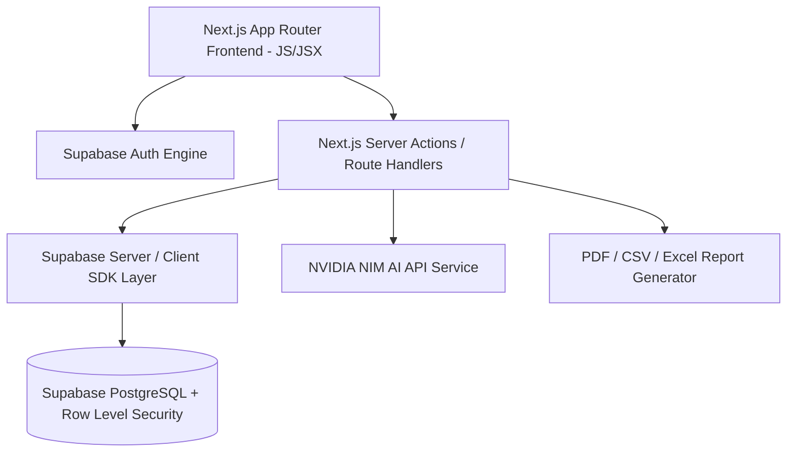

# Rupiyo — Project Overview

## 1. Executive Summary
**Rupiyo** is an enterprise-grade, production-ready personal finance management and expense tracking web application. Designed to bridge the gap between simple manual expense trackers and complex accounting platforms, Rupiyo offers individuals, salaried professionals, freelancers, students, and families a unified, secure dashboard to manage multi-account wealth, track income and expenditures, automate recurring obligations, set targeted savings goals, enforce budgets, analyze spending trends, and receive actionable, non-advisory financial insights.

---

## 2. Product Vision
To empower users with absolute financial clarity and discipline through an intuitive, accessible, high-performance, and visually modern fintech web application. Rupiyo transforms raw daily transaction logs into intelligent financial awareness, eliminating money friction and fostering long-term saving habits.

---

## 3. Core Value Proposition
- **Multi-Account Visibility**: Single-pane dashboard aggregating Cash, Bank Accounts, UPI Wallets, Credit Cards, and Savings.
- **Precision Budgeting**: Real-time monthly and category-level budget tracking with predictive threshold alerts (50%, 80%, 100%, Over-Budget).
- **Goal-Driven Savings**: Structured milestone tracking with automated contribution logging and progress visualizations.
- **Idempotent Recurring Automation**: Robust background scheduling engine handling salaries, rent, subscriptions, EMIs, and utility bills without duplicate entries.
- **Actionable AI Insights**: Non-investment, rule-backed data synthesis powered by **NVIDIA NIM AI API** highlighting spending anomalies, category spikes, and savings opportunities.
- **Supabase Zero-Trust Security**: Multi-tenant data isolation, server-side ownership enforcement, mandatory **PostgreSQL Row Level Security (RLS)**, and OWASP-compliant security controls.

---

## 4. Target User Personas
1. **The Salaried Professional**: Needs automated transaction categorization, salary allocation tracking, credit card balance management, and monthly savings reports.
2. **The Freelancer / Gig Worker**: Manages variable monthly income streams, client invoices, business vs. personal expense segregation, and tax-ready summaries.
3. **The Student / Beginner**: Requires zero-friction entry, strict budget boundaries for food and entertainment, and visual savings milestone tracking.
4. **The Household Manager / Family User**: Focuses on recurring bill management (rent, utilities, tuition, insurance), category spending caps, and emergency fund goals.

---

## 5. Key System Goals & Scope
### In-Scope (V1 Production Release)
- Secure authentication via **Supabase Auth** (Email/Password, Google OAuth, Email Verification, Password Reset).
- Relational data architecture powered by **Supabase PostgreSQL** with mandatory **Row Level Security (RLS)** on all user tables.
- Financial management across Accounts, Transactions, Categories, Payment Methods, Budgets, Savings Goals, and Recurring Schedules.
- Deep visual analytics, customizable date filtering, and multi-format report exports (PDF, Excel, CSV).
- In-app notification center for financial alerts, goal milestones, and recurring reminders.
- Mobile-first responsive web design with dark and light theme options.

### Non-Goals (Out of Scope for V1)
- Storing or scraping live banking credentials (no Plaid/Yodlee/PNS integrations in V1).
- Direct peer-to-peer money transfers or payment gateway processing.
- Personalized stock, crypto, or mutual fund investment advice.
- Filing income tax returns directly from the application.

---

## 6. High-Level System Architecture Overview

---

## 7. Success Criteria
- **Functional**: 100% accurate financial aggregation (Balance = Total Income - Total Expenses ± Account Transfer Balances). Zero cross-user data leakage guaranteed via RLS policies.
- **Performance**: Dashboard initial load under 1.2s; transaction filter response under 300ms.
- **Reliability**: Idempotent processing of recurring transactions with 0 duplicate executions.
- **Security**: Passed OWASP Top 10 security audit; 100% RLS coverage on all private user tables; zero server secret leakage.
