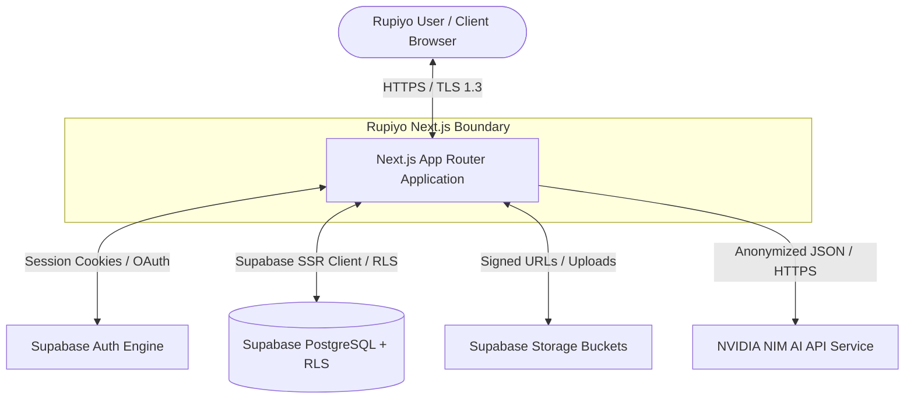
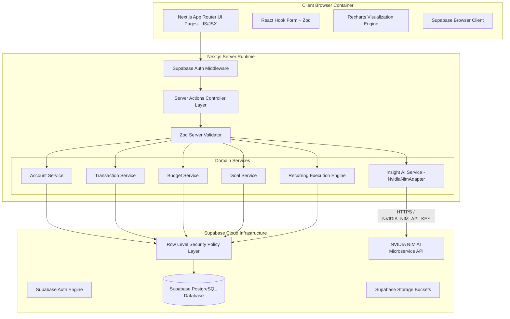
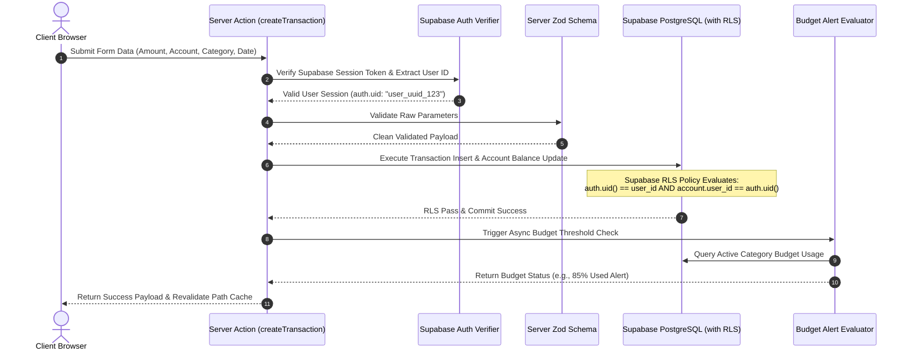
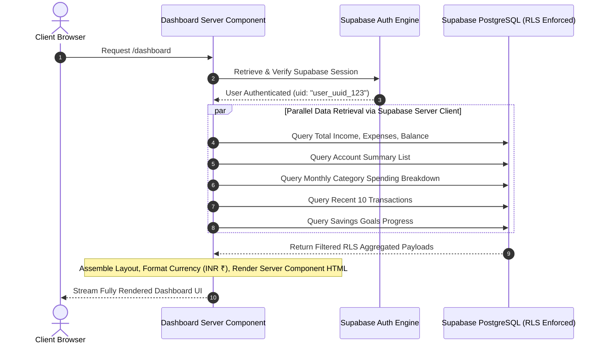
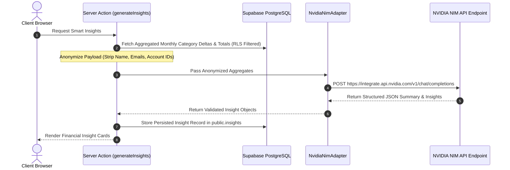

# Rupiyo — System Architecture Specification

## 1. Architectural Principles
Rupiyo is architected around five foundational pillars:
1. **Modular Monolith in Next.js**: Domain logic grouped cleanly into modular service components while keeping deployment simplified via Next.js App Router.
2. **Supabase Zero-Trust Security**: Every database query executes under Supabase Row Level Security (RLS) policies, guaranteeing database-enforced multi-tenant data isolation.
3. **Relational Financial Engine**: Financial entities (Accounts, Transactions, Budgets, Goals) reside in **Supabase PostgreSQL** with full ACID transaction consistency and `NUMERIC(15, 2)` monetary precision.
4. **Idempotent Background Jobs**: Scheduled tasks (recurring payments, budget check crons) execute using atomic locks to ensure single-execution guarantees.
5. **NVIDIA NIM AI Layer**: AI financial synthesis is isolated behind an abstract `InsightService` interface using NVIDIA NIM microservices API (`https://integrate.api.nvidia.com/v1`), ensuring zero exposure of sensitive PII.

---

## 2. C4 Architecture Diagrams

### 2.1 System Context Diagram (C4 Level 1)

---

### 2.2 Container Architecture Diagram (C4 Level 2)

---

## 3. Core Operational Data Flows

### 3.1 Transaction Write Flow (Income / Expense Creation)

---

### 3.2 Dashboard Read & Aggregation Flow

---

### 3.3 NVIDIA NIM AI Insight Synthesis Flow

---

## 4. Deployment Boundaries & Scalability

- **Frontend / Application Server**: Hosted on Vercel / Cloud Provider (Next.js SSR/SSG App Router deployment).
- **Identity & Backend Service**: Managed Supabase Auth & Supabase Storage global infrastructure.
- **Database Layer**: Managed Supabase PostgreSQL with automated daily backups, read replicas, connection pooling (pgBouncer), and Row Level Security.
- **AI Infrastructure**: NVIDIA NIM API hosted microservices (`integrate.api.nvidia.com`).
