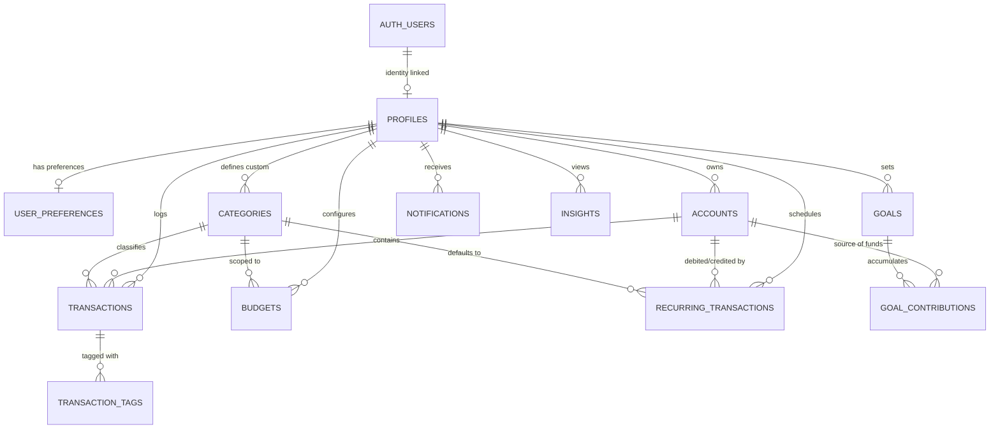

# Rupiyo — Relational Database Schema & Row Level Security (RLS) Specification

## 1. Relational Database & RLS Strategy
Rupiyo uses **Supabase PostgreSQL**. User authentication is managed in `auth.users`. All application entities reside in the `public` schema and strictly enforce:
- **Primary Keys**: UUID v4 generated via `gen_random_uuid()`.
- **User Linking**: `profiles.id` references `auth.users(id) ON DELETE CASCADE`. All user-owned tables reference `public.profiles(id)`.
- **Row Level Security (RLS)**: Mandatory `ALTER TABLE ... ENABLE ROW LEVEL SECURITY` on every private user table.
- **Monetary Storage**: Fixed-point `NUMERIC(15, 2)` to eliminate floating-point precision loss.
- **Foreign Keys**: Explicit `ON DELETE RESTRICT` or `ON DELETE CASCADE` constraints matching domain rules.
- **Check Constraints**: Active verification (`amount > 0`, `type IN ('INCOME', 'EXPENSE')`).
- **Audit Columns**: `created_at TIMESTAMPTZ DEFAULT CURRENT_TIMESTAMP`, `updated_at TIMESTAMPTZ DEFAULT CURRENT_TIMESTAMP`.

---

## 2. Mermaid Entity-Relationship (ER) Diagram



---

## 3. SQL DDL & Row Level Security (RLS) Policies

```sql
-- Enable UUID generation extension
CREATE EXTENSION IF NOT EXISTS "uuid-ossp";

-- ==========================================
-- 1. PUBLIC PROFILES TABLE (Linked to auth.users)
-- ==========================================
CREATE TABLE public.profiles (
    id UUID PRIMARY KEY REFERENCES auth.users(id) ON DELETE CASCADE,
    email VARCHAR(255) NOT NULL,
    full_name VARCHAR(100) NOT NULL,
    avatar_url TEXT NULL,
    is_onboarded BOOLEAN NOT NULL DEFAULT FALSE,
    created_at TIMESTAMPTZ NOT NULL DEFAULT CURRENT_TIMESTAMP,
    updated_at TIMESTAMPTZ NOT NULL DEFAULT CURRENT_TIMESTAMP
);

ALTER TABLE public.profiles ENABLE ROW LEVEL SECURITY;

CREATE POLICY "Users can view own profile" ON public.profiles
    FOR SELECT USING (auth.uid() = id);

CREATE POLICY "Users can update own profile" ON public.profiles
    FOR UPDATE USING (auth.uid() = id);

CREATE POLICY "Users can insert own profile" ON public.profiles
    FOR INSERT WITH CHECK (auth.uid() = id);

-- ==========================================
-- AUTOMATIC PROFILE PROVISIONING TRIGGER
-- ==========================================
CREATE OR REPLACE FUNCTION public.handle_new_user()
RETURNS TRIGGER AS $$
BEGIN
    INSERT INTO public.profiles (id, email, full_name, avatar_url)
    VALUES (
        NEW.id,
        NEW.email,
        COALESCE(NEW.raw_user_meta_data->>'full_name', NEW.email),
        NEW.raw_user_meta_data->>'avatar_url'
    );

    INSERT INTO public.user_preferences (user_id)
    VALUES (NEW.id);

    RETURN NEW;
END;
$$ LANGUAGE plpgsql SECURITY DEFINER;

CREATE OR REPLACE TRIGGER on_auth_user_created
    AFTER INSERT ON auth.users
    FOR EACH ROW EXECUTE FUNCTION public.handle_new_user();

-- ==========================================
-- 2. USER PREFERENCES TABLE
-- ==========================================
CREATE TABLE public.user_preferences (
    id UUID PRIMARY KEY DEFAULT gen_random_uuid(),
    user_id UUID NOT NULL UNIQUE REFERENCES public.profiles(id) ON DELETE CASCADE,
    base_currency VARCHAR(3) NOT NULL DEFAULT 'INR',
    currency_symbol VARCHAR(5) NOT NULL DEFAULT '₹',
    timezone VARCHAR(50) NOT NULL DEFAULT 'Asia/Kolkata',
    theme VARCHAR(10) NOT NULL DEFAULT 'light' CHECK (theme IN ('light', 'dark', 'system')),
    email_alerts BOOLEAN NOT NULL DEFAULT TRUE,
    in_app_alerts BOOLEAN NOT NULL DEFAULT TRUE,
    created_at TIMESTAMPTZ NOT NULL DEFAULT CURRENT_TIMESTAMP,
    updated_at TIMESTAMPTZ NOT NULL DEFAULT CURRENT_TIMESTAMP
);

ALTER TABLE public.user_preferences ENABLE ROW LEVEL SECURITY;

CREATE POLICY "Users can manage own preferences" ON public.user_preferences
    FOR ALL USING (auth.uid() = user_id);

-- ==========================================
-- 3. ACCOUNTS TABLE
-- ==========================================
CREATE TABLE public.accounts (
    id UUID PRIMARY KEY DEFAULT gen_random_uuid(),
    user_id UUID NOT NULL REFERENCES public.profiles(id) ON DELETE CASCADE,
    name VARCHAR(100) NOT NULL,
    type VARCHAR(20) NOT NULL CHECK (type IN ('CASH', 'BANK', 'UPI', 'WALLET', 'CREDIT_CARD', 'OTHER')),
    opening_balance NUMERIC(15, 2) NOT NULL DEFAULT 0.00,
    current_balance NUMERIC(15, 2) NOT NULL DEFAULT 0.00,
    currency VARCHAR(3) NOT NULL DEFAULT 'INR',
    is_archived BOOLEAN NOT NULL DEFAULT FALSE,
    description TEXT NULL,
    created_at TIMESTAMPTZ NOT NULL DEFAULT CURRENT_TIMESTAMP,
    updated_at TIMESTAMPTZ NOT NULL DEFAULT CURRENT_TIMESTAMP,
    CONSTRAINT uq_user_account_name UNIQUE(user_id, name)
);

CREATE INDEX idx_accounts_user_archived ON public.accounts(user_id, is_archived);

ALTER TABLE public.accounts ENABLE ROW LEVEL SECURITY;

CREATE POLICY "Users can manage own accounts" ON public.accounts
    FOR ALL USING (auth.uid() = user_id);

-- ==========================================
-- 4. CATEGORIES TABLE
-- ==========================================
CREATE TABLE public.categories (
    id UUID PRIMARY KEY DEFAULT gen_random_uuid(),
    user_id UUID NULL REFERENCES public.profiles(id) ON DELETE CASCADE, -- NULL = system default category
    name VARCHAR(100) NOT NULL,
    type VARCHAR(10) NOT NULL CHECK (type IN ('INCOME', 'EXPENSE')),
    icon_name VARCHAR(50) NOT NULL DEFAULT 'Tag',
    color_hex VARCHAR(7) NOT NULL DEFAULT '#64748B',
    is_system_default BOOLEAN NOT NULL DEFAULT FALSE,
    is_archived BOOLEAN NOT NULL DEFAULT FALSE,
    created_at TIMESTAMPTZ NOT NULL DEFAULT CURRENT_TIMESTAMP,
    updated_at TIMESTAMPTZ NOT NULL DEFAULT CURRENT_TIMESTAMP,
    CONSTRAINT uq_user_category_name UNIQUE(user_id, name, type)
);

CREATE INDEX idx_categories_user_type ON public.categories(user_id, type, is_archived);

ALTER TABLE public.categories ENABLE ROW LEVEL SECURITY;

CREATE POLICY "Users can view system or own categories" ON public.categories
    FOR SELECT USING (is_system_default = TRUE OR auth.uid() = user_id);

CREATE POLICY "Users can insert own custom categories" ON public.categories
    FOR INSERT WITH CHECK (auth.uid() = user_id AND is_system_default = FALSE);

CREATE POLICY "Users can update own custom categories" ON public.categories
    FOR UPDATE USING (auth.uid() = user_id AND is_system_default = FALSE);

CREATE POLICY "Users can delete own custom categories" ON public.categories
    FOR DELETE USING (auth.uid() = user_id AND is_system_default = FALSE);

-- ==========================================
-- 5. TRANSACTIONS TABLE
-- ==========================================
CREATE TABLE public.transactions (
    id UUID PRIMARY KEY DEFAULT gen_random_uuid(),
    user_id UUID NOT NULL REFERENCES public.profiles(id) ON DELETE CASCADE,
    account_id UUID NOT NULL REFERENCES public.accounts(id) ON DELETE RESTRICT,
    category_id UUID NOT NULL REFERENCES public.categories(id) ON DELETE RESTRICT,
    type VARCHAR(10) NOT NULL CHECK (type IN ('INCOME', 'EXPENSE')),
    amount NUMERIC(15, 2) NOT NULL CHECK (amount > 0),
    payment_method VARCHAR(20) NOT NULL CHECK (payment_method IN ('CASH', 'UPI', 'DEBIT_CARD', 'CREDIT_CARD', 'BANK_TRANSFER', 'WALLET', 'OTHER')),
    transaction_date DATE NOT NULL DEFAULT CURRENT_DATE,
    description VARCHAR(255) NULL,
    notes TEXT NULL,
    recurring_rule_id UUID NULL,
    created_at TIMESTAMPTZ NOT NULL DEFAULT CURRENT_TIMESTAMP,
    updated_at TIMESTAMPTZ NOT NULL DEFAULT CURRENT_TIMESTAMP
);

CREATE INDEX idx_transactions_user_date ON public.transactions(user_id, transaction_date DESC);
CREATE INDEX idx_transactions_account ON public.transactions(account_id);
CREATE INDEX idx_transactions_category ON public.transactions(category_id);

ALTER TABLE public.transactions ENABLE ROW LEVEL SECURITY;

CREATE POLICY "Users can manage own transactions" ON public.transactions
    FOR ALL USING (auth.uid() = user_id);

-- ==========================================
-- 6. TRANSACTION TAGS TABLE
-- ==========================================
CREATE TABLE public.transaction_tags (
    id UUID PRIMARY KEY DEFAULT gen_random_uuid(),
    transaction_id UUID NOT NULL REFERENCES public.transactions(id) ON DELETE CASCADE,
    tag_name VARCHAR(50) NOT NULL,
    created_at TIMESTAMPTZ NOT NULL DEFAULT CURRENT_TIMESTAMP,
    CONSTRAINT uq_transaction_tag UNIQUE(transaction_id, tag_name)
);

ALTER TABLE public.transaction_tags ENABLE ROW LEVEL SECURITY;

CREATE POLICY "Users can manage tags of own transactions" ON public.transaction_tags
    FOR ALL USING (
        EXISTS (
            SELECT 1 FROM public.transactions t
            WHERE t.id = transaction_id AND t.user_id = auth.uid()
        )
    );

-- ==========================================
-- 7. BUDGETS TABLE
-- ==========================================
CREATE TABLE public.budgets (
    id UUID PRIMARY KEY DEFAULT gen_random_uuid(),
    user_id UUID NOT NULL REFERENCES public.profiles(id) ON DELETE CASCADE,
    category_id UUID NULL REFERENCES public.categories(id) ON DELETE CASCADE,
    amount NUMERIC(15, 2) NOT NULL CHECK (amount > 0),
    month_year VARCHAR(7) NOT NULL, -- Format: YYYY-MM
    created_at TIMESTAMPTZ NOT NULL DEFAULT CURRENT_TIMESTAMP,
    updated_at TIMESTAMPTZ NOT NULL DEFAULT CURRENT_TIMESTAMP,
    CONSTRAINT uq_user_category_budget_period UNIQUE(user_id, category_id, month_year)
);

CREATE INDEX idx_budgets_user_period ON public.budgets(user_id, month_year);

ALTER TABLE public.budgets ENABLE ROW LEVEL SECURITY;

CREATE POLICY "Users can manage own budgets" ON public.budgets
    FOR ALL USING (auth.uid() = user_id);

-- ==========================================
-- 8. SAVINGS GOALS TABLE
-- ==========================================
CREATE TABLE public.goals (
    id UUID PRIMARY KEY DEFAULT gen_random_uuid(),
    user_id UUID NOT NULL REFERENCES public.profiles(id) ON DELETE CASCADE,
    title VARCHAR(150) NOT NULL,
    description TEXT NULL,
    target_amount NUMERIC(15, 2) NOT NULL CHECK (target_amount > 0),
    current_amount NUMERIC(15, 2) NOT NULL DEFAULT 0.00 CHECK (current_amount >= 0),
    target_date DATE NULL,
    status VARCHAR(15) NOT NULL DEFAULT 'IN_PROGRESS' CHECK (status IN ('IN_PROGRESS', 'COMPLETED', 'CANCELLED')),
    created_at TIMESTAMPTZ NOT NULL DEFAULT CURRENT_TIMESTAMP,
    updated_at TIMESTAMPTZ NOT NULL DEFAULT CURRENT_TIMESTAMP
);

CREATE INDEX idx_goals_user_status ON public.goals(user_id, status);

ALTER TABLE public.goals ENABLE ROW LEVEL SECURITY;

CREATE POLICY "Users can manage own goals" ON public.goals
    FOR ALL USING (auth.uid() = user_id);

-- ==========================================
-- 9. GOAL CONTRIBUTIONS TABLE
-- ==========================================
CREATE TABLE public.goal_contributions (
    id UUID PRIMARY KEY DEFAULT gen_random_uuid(),
    goal_id UUID NOT NULL REFERENCES public.goals(id) ON DELETE CASCADE,
    account_id UUID NOT NULL REFERENCES public.accounts(id) ON DELETE RESTRICT,
    amount NUMERIC(15, 2) NOT NULL CHECK (amount > 0),
    contribution_date DATE NOT NULL DEFAULT CURRENT_DATE,
    notes VARCHAR(255) NULL,
    created_at TIMESTAMPTZ NOT NULL DEFAULT CURRENT_TIMESTAMP
);

CREATE INDEX idx_goal_contributions_goal ON public.goal_contributions(goal_id);

ALTER TABLE public.goal_contributions ENABLE ROW LEVEL SECURITY;

CREATE POLICY "Users can manage contributions of own goals" ON public.goal_contributions
    FOR ALL USING (
        EXISTS (
            SELECT 1 FROM public.goals g
            WHERE g.id = goal_id AND g.user_id = auth.uid()
        )
    );

-- ==========================================
-- 10. RECURRING TRANSACTIONS TABLE
-- ==========================================
CREATE TABLE public.recurring_transactions (
    id UUID PRIMARY KEY DEFAULT gen_random_uuid(),
    user_id UUID NOT NULL REFERENCES public.profiles(id) ON DELETE CASCADE,
    account_id UUID NOT NULL REFERENCES public.accounts(id) ON DELETE RESTRICT,
    category_id UUID NOT NULL REFERENCES public.categories(id) ON DELETE RESTRICT,
    type VARCHAR(10) NOT NULL CHECK (type IN ('INCOME', 'EXPENSE')),
    amount NUMERIC(15, 2) NOT NULL CHECK (amount > 0),
    frequency VARCHAR(15) NOT NULL CHECK (frequency IN ('DAILY', 'WEEKLY', 'MONTHLY', 'YEARLY')),
    start_date DATE NOT NULL,
    end_date DATE NULL,
    next_date DATE NOT NULL,
    last_executed_date DATE NULL,
    status VARCHAR(10) NOT NULL DEFAULT 'ACTIVE' CHECK (status IN ('ACTIVE', 'PAUSED', 'CANCELLED')),
    payment_method VARCHAR(20) NOT NULL,
    description VARCHAR(255) NULL,
    created_at TIMESTAMPTZ NOT NULL DEFAULT CURRENT_TIMESTAMP,
    updated_at TIMESTAMPTZ NOT NULL DEFAULT CURRENT_TIMESTAMP
);

CREATE INDEX idx_recurring_due ON public.recurring_transactions(status, next_date);

ALTER TABLE public.recurring_transactions ENABLE ROW LEVEL SECURITY;

CREATE POLICY "Users can manage own recurring rules" ON public.recurring_transactions
    FOR ALL USING (auth.uid() = user_id);

-- ==========================================
-- 11. NOTIFICATIONS TABLE
-- ==========================================
CREATE TABLE public.notifications (
    id UUID PRIMARY KEY DEFAULT gen_random_uuid(),
    user_id UUID NOT NULL REFERENCES public.profiles(id) ON DELETE CASCADE,
    title VARCHAR(150) NOT NULL,
    message TEXT NOT NULL,
    type VARCHAR(20) NOT NULL CHECK (type IN ('BUDGET_ALERT', 'GOAL_MILESTONE', 'RECURRING_DUE', 'SYSTEM_INFO')),
    is_read BOOLEAN NOT NULL DEFAULT FALSE,
    link_url VARCHAR(255) NULL,
    created_at TIMESTAMPTZ NOT NULL DEFAULT CURRENT_TIMESTAMP
);

CREATE INDEX idx_notifications_user_read ON public.notifications(user_id, is_read, created_at DESC);

ALTER TABLE public.notifications ENABLE ROW LEVEL SECURITY;

CREATE POLICY "Users can manage own notifications" ON public.notifications
    FOR ALL USING (auth.uid() = user_id);

-- ==========================================
-- 12. INSIGHTS TABLE
-- ==========================================
CREATE TABLE public.insights (
    id UUID PRIMARY KEY DEFAULT gen_random_uuid(),
    user_id UUID NOT NULL REFERENCES public.profiles(id) ON DELETE CASCADE,
    title VARCHAR(150) NOT NULL,
    body TEXT NOT NULL,
    category_type VARCHAR(30) NOT NULL DEFAULT 'SPENDING_TREND',
    severity VARCHAR(10) NOT NULL DEFAULT 'INFO' CHECK (severity IN ('INFO', 'WARNING', 'POSITIVE')),
    is_dismissed BOOLEAN NOT NULL DEFAULT FALSE,
    created_at TIMESTAMPTZ NOT NULL DEFAULT CURRENT_TIMESTAMP
);

CREATE INDEX idx_insights_user_active ON public.insights(user_id, is_dismissed, created_at DESC);

ALTER TABLE public.insights ENABLE ROW LEVEL SECURITY;

CREATE POLICY "Users can manage own insights" ON public.insights
    FOR ALL USING (auth.uid() = user_id);
```
