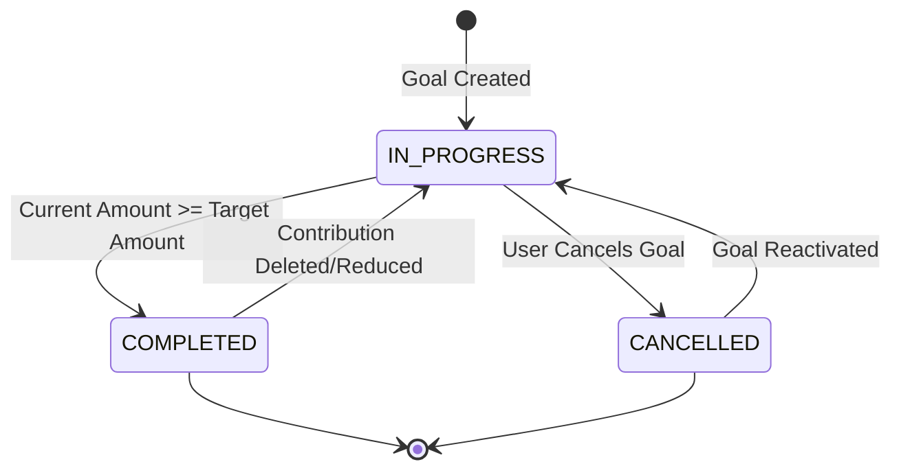
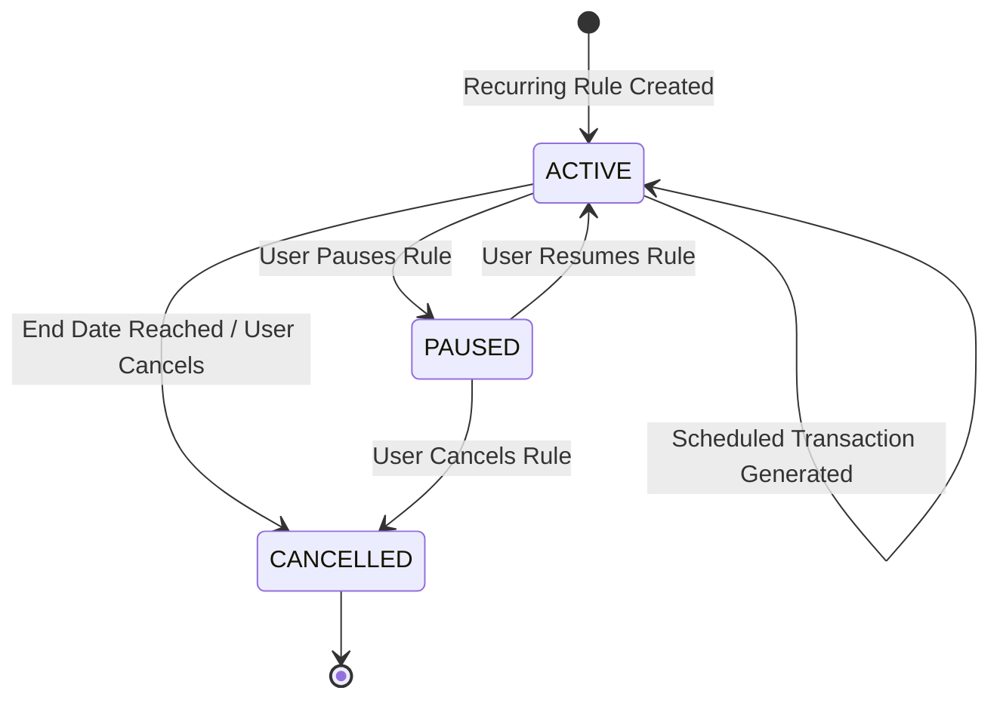

# Rupiyo — Data Model & Domain Entities Specification

## 1. Domain Entities Overview
The domain model represents the core financial abstractions within Rupiyo. Every data object operates under strict multi-tenant containment, where `User` acts as the root aggregate boundary for all child entity collections.

```text
User (Root Aggregate)
 ├── UserPreferences (1:1)
 ├── Accounts (1:N)
 │    └── Account-specific Transactions
 ├── Categories (1:N Custom + System Default References)
 ├── Transactions (1:N)
 │    └── TransactionTags (1:N)
 ├── Budgets (1:N)
 ├── Goals (1:N)
 │    └── GoalContributions (1:N)
 ├── RecurringTransactions (1:N)
 ├── Notifications (1:N)
 └── Insights (1:N)
```

---

## 2. Detailed Entity Relationships & Cardinality

### 2.1 User Entity
- **Relationships**:
  - `1 : 1` with `UserPreferences` (Cascading Delete).
  - `1 : N` with `Account` (Cascading Delete).
  - `1 : N` with `Category` (Cascading Delete for custom categories).
  - `1 : N` with `Transaction` (Cascading Delete).
  - `1 : N` with `Budget` (Cascading Delete).
  - `1 : N` with `Goal` (Cascading Delete).
  - `1 : N` with `RecurringTransaction` (Cascading Delete).
  - `1 : N` with `Notification` (Cascading Delete).
  - `1 : N` with `Insight` (Cascading Delete).

---

### 2.2 Account Entity
- **Attributes**: `id`, `user_id`, `name`, `type`, `opening_balance`, `current_balance`, `currency`, `is_archived`.
- **Relationships**:
  - `1 : N` with `Transaction` (Restrict Delete: Account cannot be deleted if transactions reference it; user must soft-archive account instead).
  - `1 : N` with `GoalContribution` (Restrict Delete).
  - `1 : N` with `RecurringTransaction` (Restrict Delete).

---

### 2.3 Transaction Entity
- **Attributes**: `id`, `user_id`, `account_id`, `category_id`, `type`, `amount`, `payment_method`, `transaction_date`, `description`, `notes`, `recurring_rule_id`.
- **Relationships**:
  - Belongs to `Account` (`N : 1`).
  - Belongs to `Category` (`N : 1`).
  - `1 : N` with `TransactionTag` (Cascading Delete).
  - Belongs optionally to `RecurringTransaction` (`N : 1` optional reference).

---

### 2.4 Budget Entity
- **Attributes**: `id`, `user_id`, `category_id` (NULL for total budget), `amount`, `month_year`.
- **Business Rule**: Uniqueness constraint on `(user_id, category_id, month_year)`. Prevents duplicate budget rules for the same category in a single month.

---

### 2.5 Goal & GoalContribution Entities
- **Goal Attributes**: `id`, `user_id`, `title`, `target_amount`, `current_amount`, `target_date`, `status`.
- **GoalContribution Attributes**: `id`, `goal_id`, `account_id`, `amount`, `contribution_date`, `notes`.
- **Lifecycle Mutation**: Inserting a `GoalContribution` automatically increments `Goal.current_amount` and deducts the contribution amount from `Account.current_balance`.

---

## 3. Entity State Machine Diagrams

### 3.1 Goal Status Transition State Machine



---

### 3.2 Recurring Rule Transition State Machine



---

## 4. Financial Mutability & Balance Update Invariants

1. **Transaction Insert Invariant**:
   ```text
   IF Transaction.type == 'INCOME' THEN
       Account.current_balance = Account.current_balance + Transaction.amount
   ELSE IF Transaction.type == 'EXPENSE' THEN
       Account.current_balance = Account.current_balance - Transaction.amount
   END IF
   ```

2. **Transaction Delete Invariant**:
   ```text
   IF Transaction.type == 'INCOME' THEN
       Account.current_balance = Account.current_balance - Transaction.amount
   ELSE IF Transaction.type == 'EXPENSE' THEN
       Account.current_balance = Account.current_balance + Transaction.amount
   END IF
   ```

3. **Transaction Update Invariant**:
   Executed as an atomic reverse of the old transaction state followed by application of the new transaction state within a single PostgreSQL transaction block.
