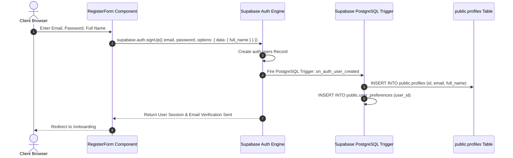
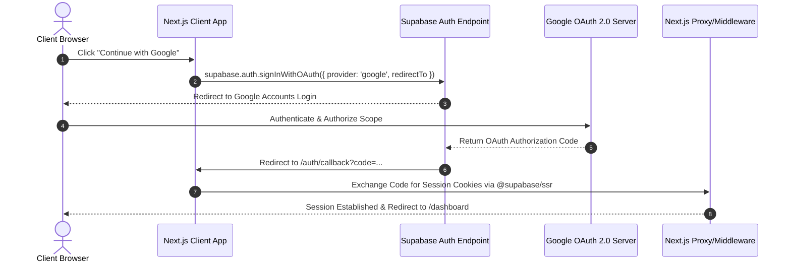

# Rupiyo — Authentication & Authorization Architecture

## 1. Overview & Architecture Strategy
Rupiyo uses **Supabase Auth** for identity management and session handling in Next.js App Router.
- **Client Web SDK**: Browser-side authentication helpers for login, signup, and OAuth popups/redirects.
- **Server SSR Client (`@supabase/ssr`)**: Cookie-based server session verification for Server Components, Server Actions, and Route Handlers.
- **Database Authorization**: **Supabase Row Level Security (RLS)** enforces row ownership (`auth.uid() = user_id`) on all queries.

---

## 2. Authentication Flow Diagrams

### 2.1 Email & Password Sign Up & Automatic Profile Provisioning



---

### 2.2 Google OAuth Authentication Flow



---

## 3. Session Persistence & Protected Route Middleware

Next.js Middleware (`middleware.js`) intercepts requests to enforce route access boundaries:

```js
import { createServerClient } from '@supabase/ssr';
import { NextResponse } from 'next/server';

export async function middleware(request) {
  let response = NextResponse.next({ request: { headers: request.headers } });

  const supabase = createServerClient(
    process.env.NEXT_PUBLIC_SUPABASE_URL,
    process.env.NEXT_PUBLIC_SUPABASE_ANON_KEY,
    {
      cookies: {
        getAll() { return request.cookies.getAll(); },
        setAll(cookiesToSet) {
          cookiesToSet.forEach(({ name, value, options }) => request.cookies.set(name, value));
          response = NextResponse.next({ request });
          cookiesToSet.forEach(({ name, value, options }) => response.cookies.set(name, value, options));
        },
      },
    }
  );

  const { data: { user } } = await supabase.auth.getUser();
  const { pathname } = request.nextUrl;

  const isProtectedRoute =
    pathname.startsWith('/dashboard') ||
    pathname.startsWith('/transactions') ||
    pathname.startsWith('/accounts') ||
    pathname.startsWith('/budgets') ||
    pathname.startsWith('/goals') ||
    pathname.startsWith('/settings');

  if (isProtectedRoute && !user) {
    const loginUrl = new URL('/login', request.url);
    loginUrl.searchParams.set('redirect', pathname);
    return NextResponse.redirect(loginUrl);
  }

  return response;
}
```

---

---

## 5. Supabase OAuth 2.1 & OIDC Server Endpoints

For third-party app integrations and OIDC authentication discovery:

| Endpoint Type | Protocol / Spec | Target URL |
|---|---|---|
| **Authorization Endpoint** | OAuth 2.1 | `https://kaljmvhnnoknupzkzptz.supabase.co/auth/v1/oauth/authorize` |
| **Token Endpoint** | OAuth 2.1 | `https://kaljmvhnnoknupzkzptz.supabase.co/auth/v1/oauth/token` |
| **JWKS Endpoint** | JSON Web Key Set | `https://kaljmvhnnoknupzkzptz.supabase.co/auth/v1/.well-known/jwks.json` |
| **OIDC Discovery** | OpenID Connect | `https://kaljmvhnnoknupzkzptz.supabase.co/auth/v1/.well-known/openid-configuration` |
