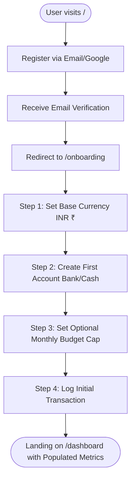
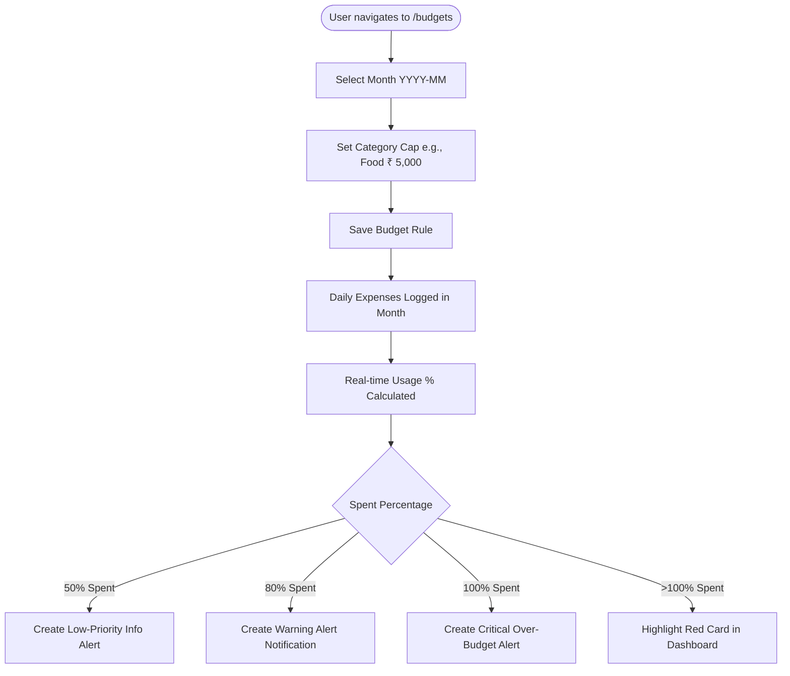

# Rupiyo — User Journey Specifications

## 1. Journey Overview
User journeys define the end-to-end paths users take to achieve key financial outcomes in Rupiyo. Each flow is optimized to minimize friction, eliminate ambiguity, and provide immediate visual feedback.

---

## 2. Core User Journey Flowcharts

### 2.1 New User Onboarding Journey



---

### 2.2 Daily Expense Tracking Journey

```mermaid
flowchart TD
    LogStart([User opens app on mobile/desktop]) --> ClickAdd[Click "+ Add Expense" Button]
    ClickAdd --> OpenModal[Add Transaction Drawer/Modal Opens]
    OpenModal --> EnterAmount[Enter Amount e.g., ₹ 450.00]
    EnterAmount --> SelectAccount[Select Account e.g., UPI Wallet]
    SelectAccount --> SelectCategory[Select Category e.g., Food]
    SelectCategory --> EnterDesc[Optional Description & Tags]
    EnterDesc --> Submit[Submit Transaction Form]
    
    Submit --> OptimisticUI[Instant UI Optimistic Row Add]
    OptimisticUI --> ServerCommit[Server Action Persists to PostgreSQL]
    ServerCommit --> RecalcBalance[Account Balance Deducted]
    RecalcBalance --> BudgetCheck{Category Budget Threshold Met?}
    
    BudgetCheck -- Yes (>=80%) --> ShowAlert[Emit Budget Alert Toast & Notification]
    BudgetCheck -- No --> CloseModal[Close Modal & Show Success Toast]
    ShowAlert --> CloseModal
```

---

### 2.3 Monthly Budgeting & Threshold Alert Journey



---

### 2.4 Savings Goal Milestone Journey

```mermaid
flowchart TD
    StartGoal([User navigates to /goals]) --> CreateGoal[Create Goal: "New Laptop" - Target: ₹ 80,000]
    CreateGoal --> GoalCreated[Goal Card Rendered at 0% Progress]
    
    GoalCreated --> AddDeposit[Click "Contribute to Goal"]
    AddDeposit --> EnterDeposit[Enter Amount: ₹ 10,000 & Select Source Account]
    EnterDeposit --> ProcessDeposit[Server Action Debits Account & Increments Goal]
    
    ProcessDeposit --> CheckCompletion{Saved >= Target?}
    CheckCompletion -- No --> UpdateProgress[Update Goal Radial Chart e.g., 12.5%]
    CheckCompletion -- Yes --> TriggerMilestone[Mark Status COMPLETED & Trigger Celebration Banner]
```

---

### 2.5 Monthly Review & Financial Report Export Journey

```mermaid
flowchart TD
    ReviewStart([User accesses /reports at end of month]) --> SelectFilter[Select Filter: Previous Month]
    SelectFilter --> ChooseFormat[Choose Export Format: PDF / CSV / Excel]
    ChooseFormat --> Generate[Click "Generate Report"]
    Generate --> ServerStream[Server Handler Compiles Financial Summary]
    ServerStream --> Download[Browser Downloads PDF Report File]
    Download --> UserReview[User Reviews Net Savings & Category Deltas]
```
