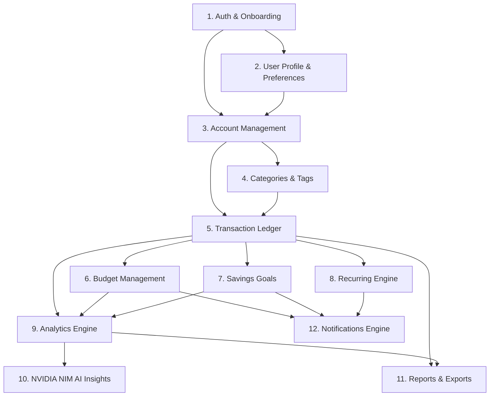

# Rupiyo — System Modules Architecture

## 1. Overview & Module Inventory
Rupiyo is divided into 16 functional modules. All data-backed modules interact with **Supabase PostgreSQL** via **Supabase Row Level Security (RLS)**.

---

## 2. Detailed Module Breakdown

### Module 1: Authentication & Onboarding
- **Responsibility**: Registration, Login, Password Reset, Google OAuth via **Supabase Auth**.
- **Services**: `lib/supabase/client.js`, `lib/supabase/server.js`, `lib/actions/auth-actions.js`.
- **Database Scope**: `auth.users` table, `middleware.js` session routing.

### Module 2: User Profile & Preferences
- **Responsibility**: Profile details (`public.profiles`), theme (Light/Dark/System), default base currency (INR `₹`), timezone.
- **Trigger**: Automatic creation on `auth.users` insert via `handle_new_user()` PostgreSQL function.

### Module 3: Account Management
- **Responsibility**: Cash, Bank, UPI, Wallet, Credit Card accounts CRUD, opening balances, live balance updates.
- **Security**: Supabase RLS `auth.uid() = user_id`.

### Module 4: Categories & Tags
- **Responsibility**: System default categories and custom user categories.
- **Security**: System categories (`is_system_default = true`) readable by all authenticated users; custom categories restricted to owner user ID.

### Module 5: Transaction Ledger
- **Responsibility**: Income and expense logging, date filtering, pagination, tag association, balance updates.
- **Security**: Supabase RLS `auth.uid() = user_id`.

### Module 6: Budget Management
- **Responsibility**: Monthly spending caps, category budgets, consumption tracking, threshold alert generation.

### Module 7: Savings Goals
- **Responsibility**: Goals CRUD, deposit contributions, goal progress percentages, target date tracking.

### Module 8: Recurring Transactions Engine
- **Responsibility**: Scheduled recurring income/expense execution, idempotency locks, next-date calculations.

### Module 9: Financial Analytics Engine
- **Responsibility**: Deterministic SQL aggregation queries for income, expenses, cash flow, category breakdowns.

### Module 10: NVIDIA NIM AI Smart Insights
- **Responsibility**: Synthesize financial trends via `NvidiaNimAdapter` (`meta/llama-3.1-70b-instruct`) using anonymized aggregates.

### Module 11: Reports & Export Engine
- **Responsibility**: Server-side PDF, Excel, and CSV file generation.

### Module 12: Notification System
- **Responsibility**: In-app alerts for budgets, recurring dues, goal milestones.

### Module 13: Search & Multi-Filter Engine
- **Responsibility**: Instant server-side multi-parameter querying across financial ledger.

### Module 14: Supabase Storage & File Attachments
- **Responsibility**: Avatar uploads and report asset persistence in protected Supabase Storage buckets.

### Module 15: Settings & Self-Service Data Erasure
- **Responsibility**: Preferences management, export user data, full account deletion (`CASCADE` wipe).

### Module 16: System Diagnostics & Health Monitoring
- **Responsibility**: API health status checks, Supabase database connectivity status, error logging.
