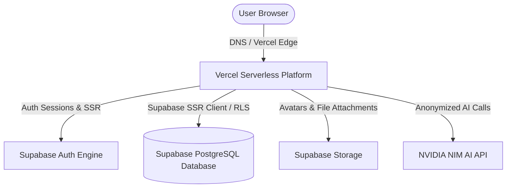

# Rupiyo — Production Deployment & Infrastructure Guide

## 1. Production Architecture Overview
Rupiyo is deployed on a modern serverless infrastructure stack:
- **Application Server**: Hosted on **Vercel** (Next.js App Router Node.js runtime).
- **Backend & Database Platform**: **Supabase** (Supabase Auth, Supabase PostgreSQL, Row Level Security, Supabase Storage).
- **AI Infrastructure**: **NVIDIA NIM AI API** (`https://integrate.api.nvidia.com/v1`).



---

## 2. Production Environment Configuration Checklist

Configure the following environment variables in Vercel Project Settings:

```env
# APP CONFIGURATION
NEXT_PUBLIC_APP_URL=https://rupiyo.app

# SUPABASE CONFIGURATION
NEXT_PUBLIC_SUPABASE_URL=https://<your-project-id>.supabase.co
NEXT_PUBLIC_SUPABASE_ANON_KEY=eyJhbGciOiJIUzI1Ni...

# SERVER-ONLY PRIVILEGED KEYS (DO NOT EXPOSE TO CLIENT)
SUPABASE_SERVICE_ROLE_KEY=eyJhbGciOiJIUzI1Ni...

# NVIDIA NIM AI CONFIGURATION
AI_PROVIDER=nvidia_nim
NVIDIA_NIM_API_KEY=nvapi-...
NVIDIA_NIM_BASE_URL=https://integrate.api.nvidia.com/v1
NVIDIA_NIM_MODEL=meta/llama-3.1-70b-instruct
NVIDIA_NIM_TIMEOUT_MS=8000

# APPLICATION DEFAULTS
NEXT_PUBLIC_DEFAULT_CURRENCY=INR
NEXT_PUBLIC_DEFAULT_LOCALE=en-IN
```

---

## 3. Database Migration Deployment via Supabase CLI
Production database updates are executed strictly via migration scripts:

```bash
# Link local repository to production Supabase project
npx supabase link --project-ref <your-project-id>

# Apply pending schema and RLS policy migrations
npx supabase db push
```

---

## 4. Production Build & Deployment Pipeline
1. **GitHub Push**: Code pushed to `main` branch.
2. **Automated CI**: Runs `npm run build` static compilation check.
3. **Database Migration**: Executes `npx supabase db push`.
4. **Vercel Deployment**: Deploys production Next.js build.
