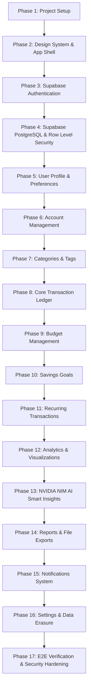

# Rupiyo — Master Development Phases & Atomic Task Breakdown

## 1. Overview
This document organizes Rupiyo's development into **26 sequential execution phases**. Every phase consists of atomic, testable tasks with unique IDs.

---

## 2. Master Execution Phases Matrix

---

## 3. Phase Specifications & Task Checklists

### PHASE 1 — Project Foundation
- **Objective**: Scaffold Next.js App Router JS project, base utility setup, and environment config validator.
- **Tasks**:
  - [x] **P01-T01**: Scaffold Next.js App Router project using JavaScript (`.js`/`.jsx`).
  - [x] **P01-T02**: Install core npm dependencies (`lucide-react`, `recharts`, `react-hook-form`, `zod`, `date-fns`, `@supabase/ssr`, `@supabase/supabase-js`).
  - [x] **P01-T03**: Configure `@/*` import alias in `jsconfig.json`.
  - [x] **P01-T04**: Establish project directory structure (`/app`, `/components`, `/lib`, `/docs`, `/public`).
  - [x] **P01-T05**: Configure `.env.example` blueprint and environment validation utility (`lib/config/env.js`).

---

### PHASE 2 — Design System & Application Shell
- **Objective**: Build reusable shadcn/ui components, CSS variables, and layout navigation shell.
- **Tasks**:
  - [x] **P02-T01**: Setup Tailwind HSL color tokens in `globals.css` and `tailwind.config.js`.
  - [x] **P02-T02**: Install and configure shadcn/ui base primitives (`Button`, `Input`, `Card`, `Modal`, `Badge`, `Skeleton`).
  - [x] **P02-T03**: Implement App Navigation Shell (`Sidebar.jsx`, `Header.jsx`, `MobileNav.jsx`).
  - [x] **P02-T04**: Implement Dark Mode / Light Mode theme provider using `next-themes`.

---

### PHASE 3 — Supabase Authentication
- **Objective**: Connect client and server identity verification via Supabase Auth.
- **Tasks**:
  - [x] **P03-T01**: Initialize Client Supabase SDK (`lib/supabase/client.js`).
  - [x] **P03-T02**: Initialize Server Supabase SSR SDK (`lib/supabase/server.js`).
  - [x] **P03-T03**: Implement Email/Password registration form and action (`RegisterForm.jsx`).
  - [x] **P03-T04**: Implement Email/Password login form and action (`LoginForm.jsx`).
  - [x] **P03-T05**: Integrate Google OAuth Sign-in provider (`GoogleAuthButton.jsx`).
  - [x] **P03-T06**: Implement Password Recovery request and reset handlers (`ForgotPasswordForm.jsx`).
  - [x] **P03-T07**: Implement Next.js Protected Route Middleware (`middleware.js`).

---

### PHASE 4 — Supabase PostgreSQL & Row Level Security (RLS)
- **Objective**: Provision Supabase PostgreSQL schema, automatic triggers, and atomic RLS policies for all 12 core tables.
- **Tasks**:
  - [x] **P04-T01**: Create Supabase project configuration (`supabase/config.toml`).
  - [x] **P04-T02**: Create DDL migrations for 12 core tables (`supabase/migrations/001_initial_schema.sql`).
  - [x] **P04-T03**: Implement database profile trigger (`handle_new_user()`).
  - [x] **P04-T04**: Create seed script for system default categories (`scripts/seed.js`).
  - [x] **P04-T05**: Enable RLS and create security policies on `profiles` and `user_preferences`.
  - [x] **P04-T06**: Enable RLS and create security policies on `accounts`.
  - [x] **P04-T07**: Enable RLS and create security policies on `categories`.
  - [x] **P04-T08**: Enable RLS and create security policies on `transactions` and `transaction_tags`.
  - [x] **P04-T09**: Enable RLS and create security policies on `budgets`.
  - [x] **P04-T10**: Enable RLS and create security policies on `goals` and `goal_contributions`.
  - [x] **P04-T11**: Enable RLS and create security policies on `recurring_transactions`.
  - [x] **P04-T12**: Enable RLS and create security policies on `notifications` and `insights`.
  - [x] **P04-T13**: Create Supabase Storage bucket and access policies (`avatars`).
  - [x] **P04-T14**: Implement cross-user RLS security automated test suite (`tests/rls/rls-security.test.js`).

---

### PHASE 5 — User Profile & Onboarding
- **Objective**: Build 4-step onboarding wizard and user profile management.
- **Tasks**:
  - [x] **P05-T01**: Build 4-step Onboarding Wizard UI (`/onboarding`).
  - [x] **P05-T02**: Implement user preferences update action (`updatePreferencesAction()`).

---

### PHASE 6 — Account Management Module
- **Tasks**:
  - [x] **P06-T01**: Implement Account Server Actions (`createAccountAction()`, `getAccountsAction()`).
  - [x] **P06-T02**: Build Accounts List and Account Detail screens (`/accounts`).

---

### PHASE 7 — Categories & Payment Methods
- **Tasks**:
  - [x] **P07-T01**: Implement Category Server Actions (`createCategoryAction()`, `getCategoriesAction()`).
  - [x] **P07-T02**: Build Custom Category creation modal.

---

### PHASE 8 — Core Transaction Ledger
- **Tasks**:
  - [x] **P08-T01**: Implement Transaction CRUD Server Actions (`createTransactionAction()`, `getTransactionsAction()`).
  - [x] **P08-T02**: Build Transaction Ledger view with server-side pagination (`/transactions`).

---

### PHASE 9 — Budget Management Module
- **Tasks**:
  - [x] **P09-T01**: Implement Budget Server Actions (`upsertBudgetAction()`, `getBudgetsAction()`).
  - [x] **P09-T02**: Build Budget Progress Cards UI (`/budgets`).

---

### PHASE 10 — Savings Goals Module
- **Tasks**:
  - [x] **P10-T01**: Implement Goal CRUD and Contribution Server Actions.
  - [x] **P10-T02**: Build Goals Progress dashboard (`/goals`).

---

### PHASE 11 — Recurring Transactions Module
- **Tasks**:
  - [x] **P11-T01**: Build Recurring Execution Engine service with atomic idempotency locks.

---

### PHASE 12 — Financial Analytics & Visualizations
- **Tasks**:
  - [x] **P12-T01**: Implement Analytics aggregation SQL queries.
  - [x] **P12-T02**: Build Recharts visual analytics dashboard (`/analytics`).

---

### PHASE 13 — NVIDIA NIM AI Smart Insights Module
- **Tasks**:
  - [x] **P13-T01**: Implement `NvidiaNimAdapter` calling NVIDIA NIM API (`meta/llama-3.1-70b-instruct`).
  - [x] **P13-T02**: Build Smart Insights view (`/insights`).

---

### PHASE 14 — Reports & File Export Module
- **Tasks**:
  - [x] **P14-T01**: Implement PDF, Excel, and CSV export Route Handlers (`/api/reports/export`).

---

### PHASE 15 — Notification System Module
- **Tasks**:
  - [x] **P15-T01**: Build Notification Center drawer and alert triggers.

---

### PHASE 16 — Executive Dashboard Summary Engine
- **Tasks**:
  - [x] **P16-T01**: Build Executive Dashboard summary view with Net Worth metrics (`/dashboard`).

---

### PHASE 17 — Production Hardening & Verification
- **Tasks**:
  - [x] **P17-T01**: Execute full OWASP security audit and E2E verification test suites.
